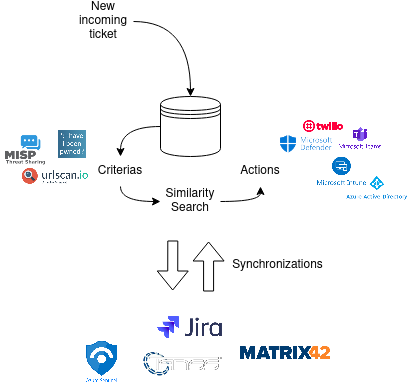

Open source version of Capivara - **Ca**tegorizer and **P**ursuer of **I**nformation Based on **R**epresentations

This project is slowly being open-sourced based on the proprietary version of the same system. Stay tuned :slightly_smiling_face:

Project overview:

Goals:
* Mechanism for search and retrieve tickets
* Cognitive layer above our database of historical tickets
* Was born from the natural growth of the ticket classification case

Guidelines:
* Easy maintenance: Continuous retraining and evaluation
* Security & Privacy: Automated anonymization of tickets
* Low-cost: "Use" when the tools were already bought, "build" when they weren't
* Flexibility: Easy to expand to many use cases

# Features and concepts

Criterias:

* Analyze an incoming ticket
* Search for information with Open Source Intelligence providers, such as HaveIBeenPawner, Misp, among others
* Performed queries in custom data sources

Similarity search:

* Retrieve past similar tickets
* Based on techniques of Information Retrieval and Recommender Systems

Decision:

* Decide if the ticket is a true positive or false positive
* Apply classification techniques
* Automatically dispatch/route an incoming ticket to the best available analyst (based on who solved past similar problems)
* Outlier detection (not similar to past tickets)
* Clustering (groups of similar tickets)

Actions:

* Activities to perform once the initial triage is done
* Can be performed manually or automatically
* Isolate a device, reset passwords, send messages, etc
